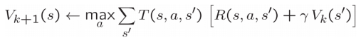
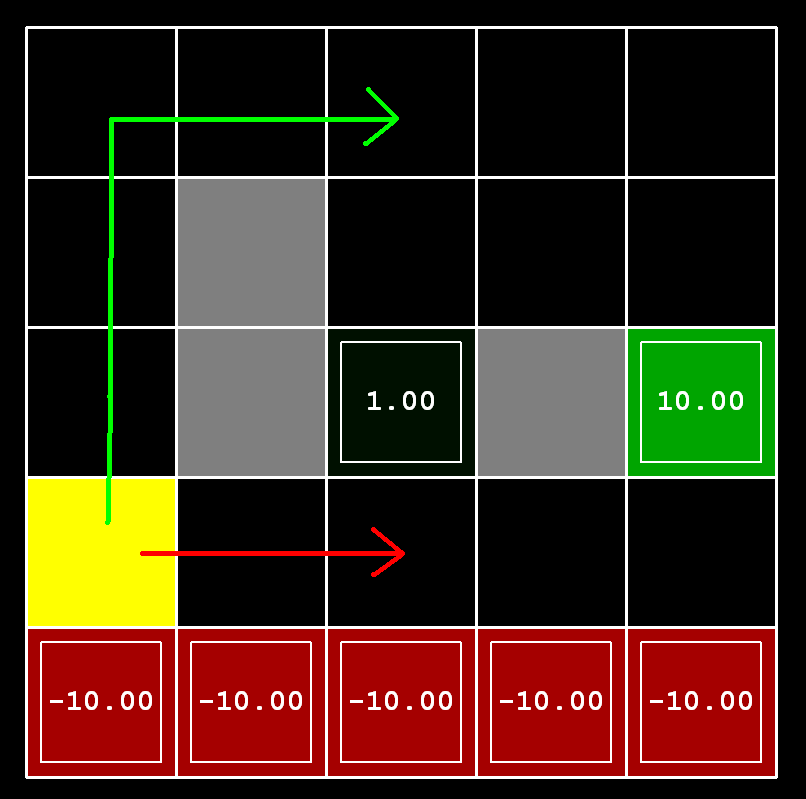
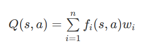
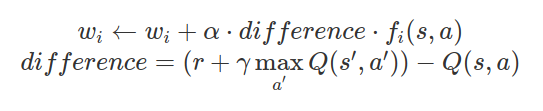

# Project 3: Reinforcement Learning

Version 1.001. Last Updated: 9 Mar 2022.

**Due by Tue 22 Mar 23:59**

------------------------------------------------------------------------

Table of Contents
-----------------

-   [Introduction](#introduction)
-   [Welcome](#welcome)
-   [Q1: Value Iteration](#Q1)
-   [Q2: Bridge Crossing Analysis](#Q2)
-   [Q3: Policies](#Q3)
-   [Q4: Asynchronous Value Iteration](#Q4)
-   [Q5: Prioritized Sweeping Value Iteration](#Q5)
-   [Q6: Q-Learning](#Q6)
-   [Q7: Epsilon Greedy](#Q7)
-   [Q8: Bridge Crossing Revisited](#Q8)
-   [Q9: Q-Learning and Pacman](#Q9)
-   [Q10: Approximate Q-Learning](#Q10)
-   [Submission](#submission)

------------------------------------------------------------------------

Pacman seeks reward.\
Should he eat or should he run?\
When in doubt, Q-learn.

--------------------------

## Introduction

In this project, you will implement value iteration and Q-learning. You
will test your agents first on Gridworld (from class), then apply them
to a simulated robot controller (Crawler) and Pacman.

As in previous projects, this project includes an autograder for you to
grade your solutions on your machine. This can be run on all questions
with the command:

    python autograder.py

It can be run for one particular question, such as q2, by:

    python autograder.py -q q2

It can be run for one particular test by commands of the form:

    python autograder.py -t test_cases/q2/1-bridge-grid

See the [Submission](#submission) section below and the autograder tutorial in Project 0 for more information about using the autograder.

The code for this project contains the following files, available as a
[zip archive](https://github.com/williamdemeo/cs370-spring2022/raw/master/projects/Project3/reinforcement.zip).

| Files you\'ll edit                     | Description                                                   |
|----------------------------------------|---------------------------------------------------------------|
| `valueIterationAgents.py`              | A value iteration agent for solving known MDPs.               |
| `qlearningAgents.py`                   | Q-learning agents for Gridworld, Crawler and Pacman.          |
| `analysis.py`                          | A file to put your answers to questions given in the project. |

| Files you should read but NOT edit     | Description                                       |
|----------------------------------------|---------------------------------------------------|
| `mdp.py`                               | Defines methods on general MDPs.                  |
| `learningAgents.py`                    | Defines the base classes `ValueEstimationAgent` and `QLearningAgent`, which your agents will extend. |
| `util.py`                              | Utilities, including `util.Counter`, which is particularly useful for Q-learners.|
| `gridworld.py`                         | The Gridworld implementation.                     |
| `featureExtractors.py`                 | Classes for extracting features on (state, action) pairs. Used for the approximate Q-learning agent (in `qlearningAgents.py`). |

| Files you can ignore           | Description |
|--------------------------------|-------------|
| `environment.py`               | Abstract class for general reinforcement learning environments. Used by `gridworld.py`. |
| `graphicsGridworldDisplay.py`  | Gridworld graphical display. |
| `graphicsUtils.py`             | Graphics utilities.  |
| `textGridworldDisplay.py`      | Plug-in for the Gridworld text interface. |
| `crawler.py`                   | The crawler code and test harness. You will run this but not edit it. |
| `graphicsCrawlerDisplay.py`    | GUI for the crawler robot. |
| `autograder.py`                | Project autograder |
| `testParser.py`                | Parses autograder test and solution files |
| `testClasses.py`               | General autograding test classes |
| `test_cases/`                  | Directory containing the test cases for each question |
| `reinforcementTestClasses.py`  | Project 3 specific autograding test classes |

**Files to Edit and Submit**. You will fill in portions of
`valueIterationAgents.py`, `qlearningAgents.py`, and `analysis.py`
during the assignment. Please *do not* change the other files in this
distribution or submit any of our original files other than these file.

<!-- *Note:* **You only need to submit `reinforcement.token`, generated by
running `submission_autograder.py`.** It contains the evaluation results
from your local autograder, and a copy of all your code. You do not need
to submit any other files. -->

**Evaluation**. Your code will be autograded for technical correctness.
Please *do not* change the names of any provided functions or classes
within the code, or you will wreak havoc on the autograder. However, the
correctness of your implementation \-- not the autograder\'s judgements
\-- will be the final judge of your score. If necessary, we will review
and grade assignments individually to ensure that you receive due credit
for your work.

**Academic Dishonesty**. We will be checking your code against other
submissions in the class for logical redundancy. If you copy someone
else\'s code and submit it with minor changes, we will know. These cheat
detectors are quite hard to fool, so please don\'t try. We trust you all
to submit your own work only; *please* don\'t let us down. If you do, we
will pursue the strongest consequences available to us.

**Getting Help**. You are not alone! If you find yourself stuck on
something, contact the course instructor for help. Office hours and
the discussion forum are there for your support; please use them. We
want these projects to be rewarding and instructional, not frustrating
and demoralizing. But, we don\'t know when or how to help unless you
ask.

**Discussion**. Please be careful not to post spoilers.

------------------------------------------------------------------------

## <a name="welcome">MDPs</a>

To get started, run Gridworld in manual control mode, which uses the
arrow keys:

    python gridworld.py -m

You will see the two-exit layout from class. The blue dot is the agent.
Note that when you press *up*, the agent only actually moves north 80%
of the time. Such is the life of a Gridworld agent!

You can control many aspects of the simulation. A full list of options
is available by running:

    python gridworld.py -h

The default agent moves randomly

    python gridworld.py -g MazeGrid

You should see the random agent bounce around the grid until it happens
upon an exit. Not the finest hour for an AI agent.

*Note:* The Gridworld MDP is such that you first must enter a
pre-terminal state (the double boxes shown in the GUI) and then take the
special \'exit\' action before the episode actually ends (in the true
terminal state called `TERMINAL_STATE`, which is not shown in the GUI).
If you run an episode manually, your total return may be less than you
expected, due to the discount rate (`-d` to change; 0.9 by default).

Look at the console output that accompanies the graphical output (or use
`-t` for all text). You will be told about each transition the agent
experiences (to turn this off, use `-q`).

As in Pacman, positions are represented by `(x,y)` Cartesian coordinates
and any arrays are indexed by `[x][y]`, with `'north'` being the
direction of increasing `y`, etc. By default, most transitions will
receive a reward of zero, though you can change this with the living
reward option (`-r`).

------------------------------------------------------------------------

## <a name="Q1">Question 1</a> (4 points): Value Iteration

Recall the value iteration state update equation:

Write a value iteration agent in `ValueIterationAgent`, which has been
partially specified for you in `valueIterationAgents.py`. Your value
iteration agent is an offline planner, not a reinforcement learning
agent, and so the relevant training option is the number of iterations
of value iteration it should run (option `-i`) in its initial planning
phase. `ValueIterationAgent` takes an MDP on construction and runs value
iteration for the specified number of iterations before the constructor
returns.

Value iteration computes k-step estimates of the optimal values, 𝑉ₖ.
In addition to running value iteration, implement the following methods
for `ValueIterationAgent` using 𝑉ₖ.

-   `computeActionFromValues(state)` computes the best action according
    to the value function given by `self.values`.
-   `computeQValueFromValues(state, action)` returns the Q-value of the
    (state, action) pair given by the value function given by
    `self.values`.

These quantities are all displayed in the GUI: values are numbers in
squares, Q-values are numbers in square quarters, and policies are
arrows out from each square.

*Important:* Use the \"batch\" version of value iteration where each
vector 𝑉ₖ is computed from a fixed vector 𝑉ₖ₋₁ (like in lecture),
not the \"online\" version where one single weight vector is updated in
place. This means that when a state\'s value is updated in iteration k
based on the values of its successor states, the successor state values
used in the value update computation should be those from iteration k-1
(even if some of the successor states had already been updated in
iteration k). The difference is discussed in [Sutton &
Barto](http://www.cs.ualberta.ca/~sutton/book/ebook/node41.html) in §4.1 (¶ 6).

*Note:* A policy synthesized from values of depth k (which reflect the
next k rewards) will actually reflect the next k+1 rewards (i.e. you
return πₖ₊₁. Similarly, the Q-values will also reflect one
more reward than the values (i.e. you return Qₖ₊₁).

You should return the synthesized policy πₖ₊₁.

*Hint:* You may optionally use the `util.Counter` class in `util.py`,
which is a dictionary with a default value of zero. However, be careful
with `argMax`: the actual argmax you want may be a key not in the
counter!

*Note:* Make sure to handle the case when a state has no available
actions in an MDP (think about what this means for future rewards).

To test your implementation, run the autograder:

    python autograder.py -q q1

The following command loads your `ValueIterationAgent`, which will
compute a policy and execute it 10 times. Press a key to cycle through
values, Q-values, and the simulation. You should find that the value of
the start state (`V(start)`, which you can read off of the GUI) and the
empirical resulting average reward (printed after the 10 rounds of
execution finish) are quite close.

    python gridworld.py -a value -i 100 -k 10

*Hint:* On the default BookGrid, running value iteration for 5
iterations should give you this output:

    python gridworld.py -a value -i 5

*Grading:* Your value iteration agent will be graded on a new grid. We
will check your values, Q-values, and policies after fixed numbers of
iterations and at convergence (e.g. after 100 iterations).

------------------------------------------------------------------------

## <a name="Q2">Question 2</a> (1 point): Bridge Crossing Analysis

`BridgeGrid` is a grid world map with the a low-reward terminal state
and a high-reward terminal state separated by a narrow \"bridge\", on
either side of which is a chasm of high negative reward. The agent
starts near the low-reward state. With the default discount of 0.9 and
the default noise of 0.2, the optimal policy does not cross the bridge.
Change only ONE of the discount and noise parameters so that the optimal
policy causes the agent to attempt to cross the bridge. Put your answer
in `question2()` of `analysis.py`. (Noise refers to how often an agent
ends up in an unintended successor state when they perform an action.)
The default corresponds to:

    python gridworld.py -a value -i 100 -g BridgeGrid --discount 0.9 --noise 0.2

*Grading:* We will check that you only changed one of the given
parameters, and that with this change, a correct value iteration agent
should cross the bridge. To check your answer, run the autograder:

    python autograder.py -q q2

------------------------------------------------------------------------

## <a name="Q3">Question 3</a> (5 points): Policies

Consider the `DiscountGrid` layout, shown below. This grid has two
terminal states with positive payoff (in the middle row), a close exit
with payoff +1 and a distant exit with payoff +10. The bottom row of the
grid consists of terminal states with negative payoff (shown in red);
each state in this \"cliff\" region has payoff -10. The starting state
is the yellow square. We distinguish between two types of paths: (1)
paths that \"risk the cliff\" and travel near the bottom row of the
grid; these paths are shorter but risk earning a large negative payoff,
and are represented by the red arrow in the figure below. (2) paths that
\"avoid the cliff\" and travel along the top edge of the grid. These
paths are longer but are less likely to incur huge negative payoffs.
These paths are represented by the green arrow in the figure below.

In this question, you will choose settings of the discount, noise, and
living reward parameters for this MDP to produce optimal policies of
several different types. **Your setting of the parameter values for each
part should have the property that, if your agent followed its optimal
policy without being subject to any noise, it would exhibit the given
behavior.** If a particular behavior is not achieved for any setting of
the parameters, assert that the policy is impossible by returning the
string `'NOT POSSIBLE'`.

Here are the optimal policy types you should attempt to produce:

a.  Prefer the close exit (+1), risking the cliff (-10)  
b.  Prefer the close exit (+1), but avoiding the cliff (-10)  
c.  Prefer the distant exit (+10), risking the cliff (-10)  
d.  Prefer the distant exit (+10), avoiding the cliff (-10)  
e.  Avoid both exits and the cliff (so an episode should never
    terminate)

To check your answers, run the autograder:

    python autograder.py -q q3

`question3a()` through `question3e()` should each return a 3-item tuple
of (discount, noise, living reward) in `analysis.py`.

*Note:* You can check your policies in the GUI. For example, using a
correct answer to 3(a), the arrow in (0,1) should point east, the arrow
in (1,1) should also point east, and the arrow in (2,1) should point
north.

*Note:* On some machines you may not see an arrow. In this case, press a
button on the keyboard to switch to qValue display, and mentally
calculate the policy by taking the arg max of the available qValues for
each state.

*Grading:* We will check that the desired policy is returned in each
case.

------------------------------------------------------------------------

## <a name="Q4">Question 4</a> (1 point): Asynchronous Value Iteration

Write a value iteration agent in `AsynchronousValueIterationAgent`,
which has been partially specified for you in `valueIterationAgents.py`.
Your value iteration agent is an offline planner, not a reinforcement
learning agent, and so the relevant training option is the number of
iterations of value iteration it should run (option `-i`) in its initial
planning phase. `AsynchronousValueIterationAgent` takes an MDP on
construction and runs *cyclic* value iteration (described in the next
paragraph) for the specified number of iterations before the constructor
returns. Note that all this value iteration code should be placed inside
the constructor (`__init__` method).

The reason this class is called `AsynchronousValueIterationAgent` is
because we will update only **one** state in each iteration, as opposed
to doing a batch-style update. Here is how cyclic value iteration works.
In the first iteration, only update the value of the first state in the
states list. In the second iteration, only update the value of the
second. Keep going until you have updated the value of each state once,
then start back at the first state for the subsequent iteration. **If
the state picked for updating is terminal, nothing happens in that
iteration**. You can implement it as indexing into the states variable
defined in the code skeleton.

As a reminder, here\'s the value iteration state update equation:

Value iteration iterates a fixed-point equation, as discussed in class.
It is also possible to update the state values in different ways, such
as in a random order (i.e., select a state randomly, update its value,
and repeat) or in a batch style (as in Q1). In Q4, we will explore
another technique.

`AsynchronousValueIterationAgent` inherits from `ValueIterationAgent`
from Q1, so the only method you need to implement is
`runValueIteration`. Since the superclass constructor calls
`runValueIteration`, overriding it is sufficient to change the agent\'s
behavior as desired.

*Note:* Make sure to handle the case when a state has no available
actions in an MDP (think about what this means for future rewards).

To test your implementation, run the autograder. It should take less
than a second to run. **If it takes much longer, you may run into issues
later in the project, so make your implementation more efficient now.**

    python autograder.py -q q4

The following command loads your `AsynchronousValueIterationAgent` in
the Gridworld, which will compute a policy and execute it 10 times.
Press a key to cycle through values, Q-values, and the simulation. You
should find that the value of the start state (`V(start)`, which you can
read off of the GUI) and the empirical resulting average reward (printed
after the 10 rounds of execution finish) are quite close.

    python gridworld.py -a asynchvalue -i 1000 -k 10

*Grading:* Your value iteration agent will be graded on a new grid. We
will check your values, Q-values, and policies after fixed numbers of
iterations and at convergence (e.g., after 1000 iterations).

------------------------------------------------------------------------

## <a name="Q5">Question 5</a> (3 points): Prioritized Sweeping Value Iteration

You will now implement `PrioritizedSweepingValueIterationAgent`, which
has been partially specified for you in `valueIterationAgents.py`. Note
that this class derives from `AsynchronousValueIterationAgent`, so the
only method that needs to change is `runValueIteration`, which actually
runs the value iteration.

Prioritized sweeping attempts to focus updates of state values in ways
that are likely to change the policy.

For this project, you will implement a simplified version of the
standard prioritized sweeping algorithm, which is described in [this
paper](http://papers.nips.cc/paper/651-memory-based-reinforcement-learning-efficient-computation-with-prioritized-sweeping.pdf).
We\'ve adapted this algorithm for our setting. First, we define the
**predecessors** of a state `s` as all states that have a **nonzero**
probability of reaching `s` by taking some action `a`. Also, `theta`,
which is passed in as a parameter, will represent our tolerance for
error when deciding whether to update the value of a state. Here\'s the
algorithm you should follow in your implementation.

-   Compute predecessors of all states.
-   Initialize an empty priority queue.
-   For each non-terminal state `s`, do: **(note: to make the autograder
    work for this question, you must iterate over states in the order
    returned by `self.mdp.getStates()`)**
    -   Find the absolute value of the difference between the current
        value of `s` in `self.values` and the highest Q-value across all
        possible actions from `s` (this represents what the value should
        be); call this number `diff`. Do NOT update `self.values[s]` in
        this step.
    -   Push `s` into the priority queue with priority `-diff` (note
        that this is **negative**). We use a negative because the
        priority queue is a min heap, but we want to prioritize updating
        states that have a **higher** error.
-   For `iteration` in `0, 1, 2, ..., self.iterations - 1`, do:
    -   If the priority queue is empty, then terminate.
    -   Pop a state `s` off the priority queue.
    -   Update `s`\'s value (if it is not a terminal state) in
        `self.values`.
    -   For each predecessor `p` of `s`, do:
        -   Find the absolute value of the difference between the
            current value of `p` in `self.values` and the highest
            Q-value across all possible actions from `p` (this
            represents what the value should be); call this number
            `diff`. Do NOT update `self.values[p]` in this step.
        -   If `diff > theta`, push p into the priority queue with
            priority `-diff` (note that this is **negative**), as long
            as it does not already exist in the priority queue with
            equal or lower priority. As before, we use a negative
            because the priority queue is a min heap, but we want to
            prioritize updating states that have a **higher** error.

A couple of important notes on implementation:

-   When you compute predecessors of a state, make sure to store them in
    a **set**, not a list, to avoid duplicates.
-   Please use `util.PriorityQueue` in your implementation. The `update`
    method in this class will likely be useful; look at its
    documentation.

To test your implementation, run the autograder. It should take about 1
second to run. **If it takes much longer, you may run into issues later
in the project, so make your implementation more efficient now.**

    python autograder.py -q q5

You can run the `PrioritizedSweepingValueIterationAgen` in the Gridworld
using the following command.

    python gridworld.py -a priosweepvalue -i 1000

*Grading:* Your prioritized sweeping value iteration agent will be
graded on a new grid. We will check your values, Q-values, and policies
after fixed numbers of iterations and at convergence (e.g., after 1000
iterations).

------------------------------------------------------------------------

## <a name="Q6">Question 6</a> (4 points): Q-Learning

Note that your value iteration agent does not actually learn from
experience. Rather, it ponders its MDP model to arrive at a complete
policy before ever interacting with a real environment. When it does
interact with the environment, it simply follows the precomputed policy
(e.g. it becomes a reflex agent). This distinction may be subtle in a
simulated environment like a Gridword, but it\'s very important in the
real world, where the real MDP is not available.

You will now write a Q-learning agent, which does very little on
construction, but instead learns by trial and error from interactions
with the environment through its
`update(state, action, nextState, reward)` method. A stub of a Q-learner
is specified in `QLearningAgent` in `qlearningAgents.py`, and you can
select it with the option `'-a q'`. For this question, you must
implement the `update`, `computeValueFromQValues`, `getQValue`, and
`computeActionFromQValues` methods.

*Note:* For `computeActionFromQValues`, you should break ties randomly
for better behavior. The `random.choice()` function will help. In a
particular state, actions that your agent *hasn\'t* seen before still
have a Q-value, specifically a Q-value of zero, and if all of the
actions that your agent *has* seen before have a negative Q-value, an
unseen action may be optimal.

*Important:* Make sure that in your `computeValueFromQValues` and
`computeActionFromQValues` functions, you only access Q values by
calling `getQValue` . This abstraction will be useful for question 10
when you override `getQValue` to use features of state-action pairs
rather than state-action pairs directly.

With the Q-learning update in place, you can watch your Q-learner learn
under manual control, using the keyboard:

    python gridworld.py -a q -k 5 -m

Recall that `-k` will control the number of episodes your agent gets to
learn. Watch how the agent learns about the state it was just in, not
the one it moves to, and \"leaves learning in its wake.\" Hint: to help
with debugging, you can turn off noise by using the `--noise 0.0`
parameter (though this obviously makes Q-learning less interesting). If
you manually steer Pacman north and then east along the optimal path for
four episodes, you should see the following Q-values:

*Grading:* We will run your Q-learning agent and check that it learns
the same Q-values and policy as our reference implementation when each
is presented with the same set of examples. To grade your
implementation, run the autograder:

    python autograder.py -q q6

------------------------------------------------------------------------

## <a name="Q7">Question 7</a> (2 points): Epsilon Greedy

Complete your Q-learning agent by implementing epsilon-greedy action
selection in `getAction`, meaning it chooses random actions an epsilon
fraction of the time, and follows its current best Q-values otherwise.
Note that choosing a random action may result in choosing the best
action - that is, you should not choose a random sub-optimal action, but
rather *any* random legal action.

You can choose an element from a list uniformly at random by calling the
`random.choice` function. You can simulate a binary variable with
probability `p` of success by using `util.flipCoin(p)`, which returns
`True` with probability `p` and `False` with probability `1-p`.

After implementing the `getAction` method, observe the following
behavior of the agent in gridworld (with epsilon = 0.3).

    python gridworld.py -a q -k 100 

Your final Q-values should resemble those of your value iteration agent,
especially along well-traveled paths. However, your average returns will
be lower than the Q-values predict because of the random actions and the
initial learning phase.

You can also observe the following simulations for different epsilon
values. Does that behavior of the agent match what you expect?

    python gridworld.py -a q -k 100 --noise 0.0 -e 0.1

    python gridworld.py -a q -k 100 --noise 0.0 -e 0.9

To test your implementation, run the autograder:

    python autograder.py -q q7

With no additional code, you should now be able to run a Q-learning
crawler robot:

    python crawler.py

If this doesn\'t work, you\'ve probably written some code too specific
to the `GridWorld` problem and you should make it more general to all
MDPs.

This will invoke the crawling robot from class using your Q-learner.
Play around with the various learning parameters to see how they affect
the agent\'s policies and actions. Note that the step delay is a
parameter of the simulation, whereas the learning rate and epsilon are
parameters of your learning algorithm, and the discount factor is a
property of the environment.

------------------------------------------------------------------------

## <a name="Q8">Question 8</a> (1 point): Bridge Crossing Revisited

First, train a completely random Q-learner with the default learning
rate on the noiseless BridgeGrid for 50 episodes and observe whether it
finds the optimal policy.

    python gridworld.py -a q -k 50 -n 0 -g BridgeGrid -e 1

Now try the same experiment with an epsilon of 0. Is there an epsilon
and a learning rate for which it is highly likely (greater than 99%)
that the optimal policy will be learned after 50 iterations?
`question8()` in `analysis.py` should return EITHER a 2-item tuple of
`(epsilon, learning rate)` OR the string `'NOT POSSIBLE'` if there is
none. Epsilon is controlled by `-e`, learning rate by `-l`.

*Note:* Your response should be not depend on the exact tie-breaking
mechanism used to choose actions. This means your answer should be
correct even if for instance we rotated the entire bridge grid world 90
degrees.

To grade your answer, run the autograder:

    python autograder.py -q q8

------------------------------------------------------------------------

## <a name="Q9">Question 9</a> (1 point): Q-Learning and Pacman

Time to play some Pacman! Pacman will play games in two phases. In the
first phase, *training*, Pacman will begin to learn about the values of
positions and actions. Because it takes a very long time to learn
accurate Q-values even for tiny grids, Pacman\'s training games run in
quiet mode by default, with no GUI (or console) display. Once Pacman\'s
training is complete, he will enter *testing* mode. When testing,
Pacman\'s `self.epsilon` and `self.alpha` will be set to 0.0,
effectively stopping Q-learning and disabling exploration, in order to
allow Pacman to exploit his learned policy. Test games are shown in the
GUI by default. Without any code changes you should be able to run
Q-learning Pacman for very tiny grids as follows:

    python pacman.py -p PacmanQAgent -x 2000 -n 2010 -l smallGrid 

Note that `PacmanQAgent` is already defined for you in terms of the
`QLearningAgent` you\'ve already written. `PacmanQAgent` is only
different in that it has default learning parameters that are more
effective for the Pacman problem (`epsilon=0.05, alpha=0.2, gamma=0.8`).
You will receive full credit for this question if the command above
works without exceptions and your agent wins at least 80% of the time.
The autograder will run 100 test games after the 2000 training games.

*Hint:* If your `QLearningAgent` works for `gridworld.py` and
`crawler.py` but does not seem to be learning a good policy for Pacman
on `smallGrid`, it may be because your `getAction` and/or
`computeActionFromQValues` methods do not in some cases properly
consider unseen actions. In particular, because unseen actions have by
definition a Q-value of zero, if all of the actions that *have* been
seen have negative Q-values, an unseen action may be optimal. Beware of
the argmax function from util.Counter!

*Note:* To grade your answer, run:

    python autograder.py -q q9

*Note:* If you want to experiment with learning parameters, you can use
the option `-a`, for example `-a epsilon=0.1,alpha=0.3,gamma=0.7`. These
values will then be accessible as `self.epsilon, self.gamma` and
`self.alpha` inside the agent.

*Note:* While a total of 2010 games will be played, the first 2000 games
will not be displayed because of the option `-x 2000`, which designates
the first 2000 games for training (no output). Thus, you will only see
Pacman play the last 10 of these games. The number of training games is
also passed to your agent as the option `numTraining`.

*Note:* If you want to watch 10 training games to see what\'s going on,
use the command:

    python pacman.py -p PacmanQAgent -n 10 -l smallGrid -a numTraining=10

During training, you will see output every 100 games with statistics
about how Pacman is faring. Epsilon is positive during training, so
Pacman will play poorly even after having learned a good policy: this is
because he occasionally makes a random exploratory move into a ghost. As
a benchmark, it should take between 1,000 and 1400 games before
Pacman\'s rewards for a 100 episode segment becomes positive, reflecting
that he\'s started winning more than losing. By the end of training, it
should remain positive and be fairly high (between 100 and 350).

Make sure you understand what is happening here: the MDP state is the
*exact* board configuration facing Pacman, with the now complex
transitions describing an entire ply of change to that state. The
intermediate game configurations in which Pacman has moved but the
ghosts have not replied are *not* MDP states, but are bundled in to the
transitions.

Once Pacman is done training, he should win very reliably in test games
(at least 90% of the time), since now he is exploiting his learned
policy.

However, you will find that training the same agent on the seemingly
simple `mediumGrid` does not work well. In our implementation, Pacman\'s
average training rewards remain negative throughout training. At test
time, he plays badly, probably losing all of his test games. Training
will also take a long time, despite its ineffectiveness.

Pacman fails to win on larger layouts because each board configuration
is a separate state with separate Q-values. He has no way to generalize
that running into a ghost is bad for all positions. Obviously, this
approach will not scale.

------------------------------------------------------------------------

## <a name="Q10">Question 10</a> (3 points): Approximate Q-Learning

Implement an approximate Q-learning agent that learns weights for
features of states, where many states might share the same features.
Write your implementation in `ApproximateQAgent` class in
`qlearningAgents.py`, which is a subclass of `PacmanQAgent`.

*Note:* Approximate Q-learning assumes the existence of a feature
function 𝑓(𝑠, 𝑎) over state and action pairs, which yields a vector
(𝑓₁(𝑠, 𝑎), …, 𝑓ᵢ(𝑠, 𝑎), …, 𝑓ₙ(𝑠, 𝑎)) of feature values. We provide
feature functions for you in `featureExtractors.py`. Feature vectors are
`util.Counter` (like a dictionary) objects containing the non-zero pairs
of features and values; all omitted features have value zero.

The approximate Q-function takes the following form

<!-- Q(s, a) = Σᵢ₌₁ⁿ fᵢ(s,a) wᵢ -->

where each weight wᵢ is associated with a particular feature
𝑓ᵢ(𝑠, 𝑎). In your code, you should implement the weight vector as a
dictionary mapping features (which the feature extractors will return)
to weight values. You will update your weight vectors similarly to how
you updated Q-values:

<!-- wᵢ ← wᵢ + α · difference · fᵢ(s,a)

difference = r + γ max \{Q(s', a'): a' ∈ Actions\} - Q(s,a) -->

Note that the 𝑑𝑖𝑓𝑓𝑒𝑟𝑒𝑛𝑐𝑒 term is the same as in normal Q-learning,
and 𝑟 is the experienced reward.

By default, `ApproximateQAgent` uses the `IdentityExtractor`, which
assigns a single feature to every `(state,action)` pair. With this
feature extractor, your approximate Q-learning agent should work
identically to `PacmanQAgent`. You can test this with the following
command:

    python pacman.py -p ApproximateQAgent -x 2000 -n 2010 -l smallGrid 

*Important:*`ApproximateQAgent` is a subclass of `QLearningAgent`, and
it therefore shares several methods like `getAction`. Make sure that
your methods in `QLearningAgent` call `getQValue` instead of accessing
Q-values directly, so that when you override `getQValue` in your
approximate agent, the new approximate q-values are used to compute
actions.

Once you\'re confident that your approximate learner works correctly
with the identity features, run your approximate Q-learning agent with
our custom feature extractor, which can learn to win with ease:

    python pacman.py -p ApproximateQAgent -a extractor=SimpleExtractor -x 50 -n 60 -l mediumGrid 

Even much larger layouts should be no problem for your
`ApproximateQAgent`. (*warning*: this may take a few minutes to train)

    python pacman.py -p ApproximateQAgent -a extractor=SimpleExtractor -x 50 -n 60 -l mediumClassic 

If you have no errors, your approximate Q-learning agent should win
almost every time with these simple features, even with only 50 training
games.

*Grading:* We will run your approximate Q-learning agent and check that
it learns the same Q-values and feature weights as our reference
implementation when each is presented with the same set of examples. To
grade your implementation, run the autograder:

    python autograder.py -q q10

*Congratulations! You have a learning Pacman agent!*

------------------------------------------------------------------------

## Submission

Submit `reinforcement.token`, generated by running
`submission_autograder.py`, to **Project 3** on Gradescope.

    python submission_autograder.py

*Note:* **You only need to submit `reinforcement.token`, generated by
running `submission_autograder.py`.** It contains the evaluation results
from your local autograder, and a copy of all your code. You do not need
to submit any other files.

Please specify any partner you may have worked with and verify that both
you and your partner are associated with the submission after
submitting.

